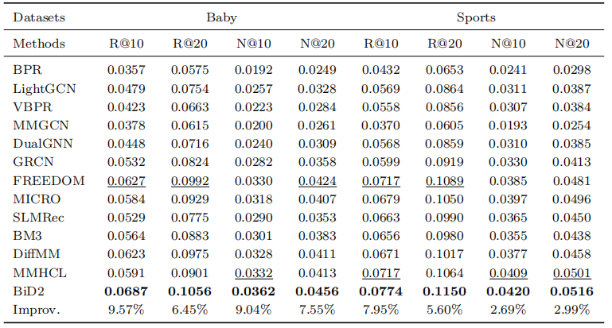
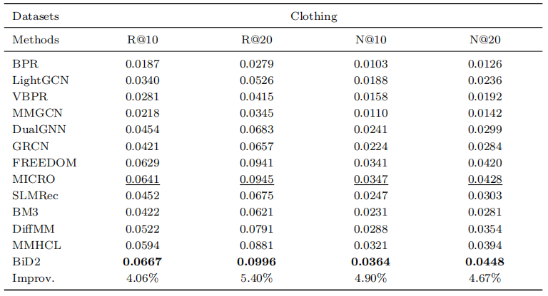

# BiD2: Bidirectional Cross-modal Distillation-based and Graph Perturbation Dual Contrastive Denoising for Multimodal Recommendations

<!-- PROJECT LOGO -->

## Introduction

This is the Pytorch implementation for our BiD2 paper:

>BiD2: Bidirectional Cross-modal Distillation-based and Graph Perturbation Dual Contrastive Denoising for Multimodal Recommendations

## Environment Requirement
- python 3.9
- Pytorch 2.1.0

## Dataset

We provide three processed datasets: Baby, Sports, Clothing.

Download from Google Drive: [Baby/Sports/Clothing](https://drive.google.com/drive/folders/1tU4IxYbLXMkp_DbIOPGvCry16uPvolLk)

## Training
  ```
  cd ./src
  python main.py
  ```
## Performance Comparison




## Acknowledgement
The structure of this code is  based on MENTOR. Thank for their work.